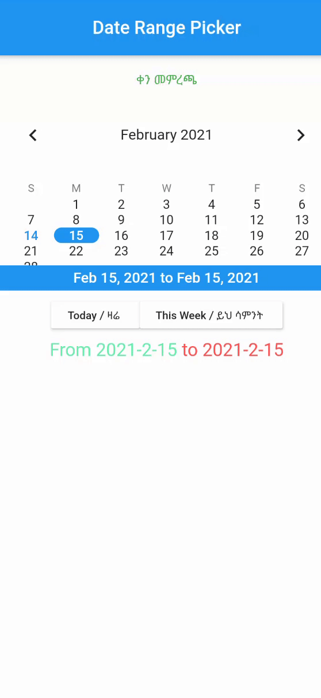

# flutter_date_pickers

Allows to use date pickers without dialog.

A set of date pickers:
   * `DayPicker` for one day
   * `WeekPicker` for whole week
   * `RangePicker` for random range

## What time I will get after selection?
If one day selected:
 you will get start of the day (00:00:00) by default. If selected `firstDate` - you will get time of it.

If range/week selected:
 for start you will get start of the day (00:00:00) by default. If selected `firstDate` - you will get time of it.
 for end you will get end of the day (23:59:59.999) by default. If selected `lastDate` - you will get time of it.

## Acknowledgements
flutter_date_pickers  
    https://pub.dev/packages/flutter_date_pickers